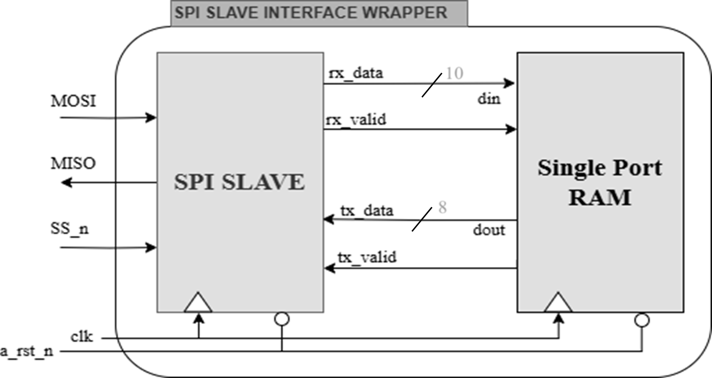

# SPI Slave with Single Port Ram 

This repository contains the Verilog implementation of an SPI Interface designed for an FPGA using Vivado. The project involves creating an SPI Slave module, Single Port RAM, and an SPI Wrapper module that integrates both.

## Project Overview

The SPI Interface project is designed to facilitate communication between a master and a slave device. The system includes:
- **SPI Slave Module**: Handles the SPI protocol and communication with the master device.
- **Single Port RAM**: Used for data storage and retrieval in synchronization with the SPI Slave.
- **SPI Wrapper Module**: Integrates the SPI Slave and RAM, managing data flow and control signals between them.
- **My Final Report**: [click..](Youssif_Ahmed_SPI_Project.pdf)

## Block Diagram

  

## Specifications

- **Clock Frequency**: [100 MHz]
- **Memory Depth**: 256
- **Address Size**: 8 bits
- **Data Bus Width**: 8 bits

## Project Structure

- [**SPI_Slave.v**](RTL_design/SPI_Slave.v): Verilog code for the SPI Slave module.
- [**single_port_Ram.v**](RTL_design/Single_Port_Ram.v): Verilog code for the Single Port RAM module.
- [**SPI_Wrapper.v**](RTL_design/SPI_Wrapper.v): Verilog code for the SPI Wrapper module.
- [**testbench.v**](Testbench/SPI_Master_tb.v): Testbench for simulating the SPI Interface.
- [**constraints.xdc**](FPGA_Flow/SPI_Constraints.xdc): Constraints file used in Vivado for FPGA implementation.
- [**synthesis/**](FPGA_Flow/Synthesis): Directory containing synthesis reports for different FSM encoding methods.
- [**Implementation/**](FPGA_Flow/Implementation): Directory containing implementation reports for different FSM encoding methods.

## FSM Encodings

The project includes synthesis reports for three FSM encoding schemes:
- **Gray Encoding**
  - [Synthesis](FPGA_Flow/Synthesis/Gray_encoding)
  - [Implementation](FPGA_Flow/Implementation/Gray_encoding)
- **One-hot Encoding**
  - [Synthesis](FPGA_Flow/Synthesis/OneHot_encoding)
  - [Implementation](FPGA_Flow/Implementation/OneHot_encoding)
- **Sequential Encoding**
  - [Synthesis](FPGA_Flow/Synthesis/Sequential_encoding)
  - [Implementation](FPGA_Flow/Implementation/Sequential_encoding)

## Acknowledgments

- Thanks to Eng. Kareem Waseem for guidance throughout the project.

**This README file provides a comprehensive overview of your SPI Interface project, including the structure, instructions, and details relevant to users and collaborators.**
