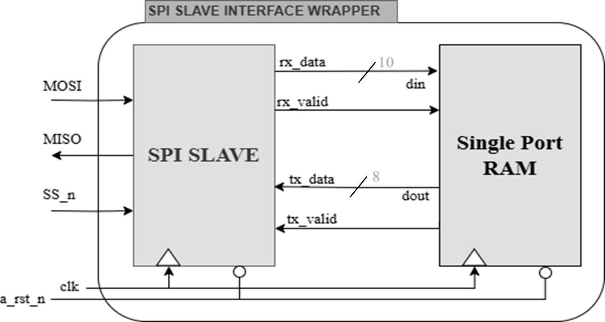

# SPI Slave with Single Port Ram 

This repository contains the Verilog implementation of an SPI Interface, taken from RTL through FPGA implementation in Vivado, RTL linting in Questa Lint, and a standard-cell ASIC flow (synthesis + DFT/scan insertion) in Synopsys Design Compiler. The project involves creating an SPI Slave module, Single Port RAM, and an SPI Wrapper module that integrates both.

## Project Overview

The SPI Interface project is designed to facilitate communication between a master and a slave device. The system includes:
- **SPI Slave Module**: Handles the SPI protocol and communication with the master device.
- **Single Port RAM**: Used for data storage and retrieval in synchronization with the SPI Slave.
- **SPI Wrapper Module**: Integrates the SPI Slave and RAM, managing data flow and control signals between them.
- **RTL Linting**: Static RTL checks in Questa Lint, catching and fixing a reset/indexing bug before synthesis.
- **ASIC Flow**: Synthesis, timing closure, and DFT/scan insertion in Synopsys Design Compiler, targeting a 130 nm standard-cell library.
- **My Final Report**: [click..](Youssif_Ahmed_SPI_Project._V2.0.pdf)

## Block Diagram

  

## Specifications

- **Clock Frequency**: 100 MHz (FPGA) / 10 MHz (ASIC flow, 100 ns period constraint)
- **Memory Depth**: 256
- **Address Size**: 8 bits
- **Data Bus Width**: 8 bits
- **ASIC Target Library**: TSMC 130 nm (scmetro_tsmc_cl013g_rvt), ss_1p08v_125c worst-case corner

## Project Structure

- [**SPI_Slave.v**](RTL_design/SPI_Slave.v): Verilog code for the SPI Slave module.
- [**single_port_Ram.v**](RTL_design/Single_Port_Ram.v): Verilog code for the Single Port RAM module.
- [**SPI_Wrapper.v**](RTL_design/SPI_Wrapper.v): Verilog code for the SPI Wrapper module.
- [**testbench.v**](Testbench/SPI_Master_tb.v): Testbench for simulating the SPI Interface.
- [**constraints.xdc**](FPGA_Flow/SPI_Constraints.xdc): Constraints file used in Vivado for FPGA implementation.
- [**synthesis/**](FPGA_Flow/Synthesis): Directory containing FPGA synthesis reports for different FSM encoding methods.
- [**Implementation/**](FPGA_Flow/Implementation): Directory containing FPGA implementation reports for different FSM encoding methods.
- [**Lint/**](Quest_Lint): Questa Lint run files, screenshots, and the final lint report.
- [**ASIC_Flow/Synthesis/**](Synthesis): Pre-DFT Design Compiler synthesis reports (area, power, setup, hold).
- [**ASIC_Flow/DFT/**](Synthesis/DFT): Post-DFT (scan-inserted) reports (area, power, setup, hold, DRC).

## FSM Encodings

The project includes synthesis reports for three FSM encoding schemes:
- **Gray Encoding**
  - [Synthesis](FPGA_Flow/Synthesis/Gray_encoding)
  - [Implementation](FPGA_Flow/Implementation/Gray_encoding)
- **One-hot Encoding**
  - [Synthesis](FPGA_Flow/Synthesis/OneHot_encoding)
  - [Implementation](FPGA_Flow/Implementation/OneHot_encoding)
- **Sequential Encoding**
  - [Synthesis](FPGA_Flow/Synthesis/Sequential_encoding)
  - [Implementation](FPGA_Flow/Implementation/Sequential_encoding)

## RTL Linting (Questa Lint)

The SPI_Slave, Single_Port_Ram, and SPI_Wrapper modules were checked with Siemens Questa Lint before synthesis.

An initial run flagged an `always_has_inconsistent_async_control` warning on the Single_Port_Ram always block, plus a repeated inline index expression (`rx_data[9-rx_counter]`) used identically in three FSM states of the SPI_Slave receive logic. The fix factors the repeated expression into a single continuous assignment (`rx_data_indx`) and restructures the always block into a clean combinational `case` statement with consistent reset handling.

| Severity | Count | Notes |
|---|---|---|
| Error | 0 | No errors remaining after the fix |
| Warning | 1 | `always_has_inconsistent_async_control` — residual note on the RAM always block, reviewed and accepted |
| Info | 3 | `fsm_without_one_hot_encoding` (expected — encoding schemes are compared intentionally) and `parameter_name_duplicate` ×2 (`MEM_DEPTH`, `ADD_SIZE` reused by design) |

**Final Design Quality Score: 99.9%** — 36 register bits, 0 latch bits, 0 blackboxes, 0 unresolved modules.

Full report: [Lint/lint.rpt](Questa_Lint/lint.rpt)

## ASIC Synthesis and DFT Insertion (Synopsys Design Compiler)

In addition to the FPGA flow, the SPI_Wrapper top module was synthesized on a TSMC 130 nm standard-cell library (`scmetro_tsmc_cl013g_rvt`, `ss_1p08v_125c` worst-case corner) with a 100 ns (10 MHz) clock constraint, then pushed through DFT scan insertion.

### Pre-DFT Synthesis

| Metric | Value |
|---|---|
| Ports | 52 |
| Nets / Cells | 11,732 / 11,684 |
| Combinational / Sequential cells | 3,432 / 8,250 |
| Total cell area | 111,840.63 µm² |
| Total power (switching + internal + leakage) | 0.349 mW (6.73×10⁻³ + 0.278 + 0.0646 mW) |
| Worst setup slack | MET, +67.81 ns |
| Worst hold slack | MET, +0.95 ns |

Worst setup path: `MOSI → RAM/mem_reg_227__2_` (arrival 31.59 ns, required 99.40 ns).
Worst hold path: `RAM/tx_valid_reg → RAM/tx_valid_reg` (arrival 0.85 ns, required −0.11 ns).

Reports: [ASIC_Flow/Synthesis/area_report.rpt](Synthesis/Syn/area_report.rpt) · [power_report.rpt](Synthesis/Syn/power_report.rpt) · [timing_setup.rpt](Synthesis/Syn/timing_setup.rpt) · [timing_hold.rpt](Synthesis/Syn/timing_hold.rpt)

### DFT / Scan Insertion

Dedicated DFT ports (`test_mode`, `SI`, `SE`, `scan_clk`, `scan_rst`, `SO`) were added and muxed onto the functional clock/reset. Using a full-scan, multiplexed-flip-flop methodology in a single clock domain, DFT Compiler stitched the sequential elements into **21 scan chains** of ~99 cells each, covering all **2,071 scannable sequential cells with 0 DRC violations** in the post-DFT check (8 informational pre-DFT warnings on scan-reset/data-input sharing cleared automatically once the chains were stitched).

| Metric | Value |
|---|---|
| Scan chains | 21 (full scan, multiplexed flip-flop, no_mix) |
| Cells per chain / total scan cells | ~99 / 2,071 (0 violations) |
| Ports (incl. DFT pins) | 144 |
| Total cell area | 111,967.72 µm² (+0.11% vs. pre-DFT) |
| Worst setup slack | MET, +67.92 ns |
| Worst hold slack | MET, +0.76 ns |

Worst setup path: `MOSI → RAM/mem_reg_0__2_` (arrival 31.48 ns, required 99.39 ns).
Worst hold path: `RAM/dout_reg_7_ → RAM/mem_reg_0__0_` (arrival 0.62 ns, required −0.15 ns), through the new scan-select mux.

Reports: [ASIC_Flow/DFT/area_report.rpt](Synthesis/DFT/area_report.rpt) · [power_report.rpt](Synthesis/DFT/power_report.rpt) · [timing_setup.rpt](Synthesis/DFT/timing_setup.rpt) · [timing_hold.rpt](Synthesis/DFT/timing_hold.rpt) · [dft_drc.rpt](Synthesis/DFT/dft_drc.rpt)

> **Note on power:** the post-DFT total power (6.820 mW) reflects Design Compiler's default toggle-rate estimate on the newly added, unannotated scan ports — not a real functional increase. The RAM and SPI_Slave sub-block power barely changed from the pre-DFT numbers.

### Summary

The design is lint-clean (0 errors), closes timing comfortably at 10 MHz in a 130 nm standard-cell library both before and after scan insertion, and achieves full-scan testability (21 chains, 2,071 cells, 0 DRC violations) for under 0.2% area overhead — complementing the three FPGA encoding implementations already in this repo.

## Acknowledgments

- Thanks to Eng. Kareem Waseem for guidance throughout the project.

**This README file provides a comprehensive overview of the SPI Interface project, including the structure, RTL linting, FPGA and ASIC flows, and details relevant to users and collaborators.**
